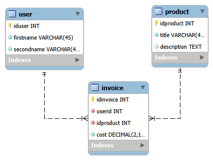
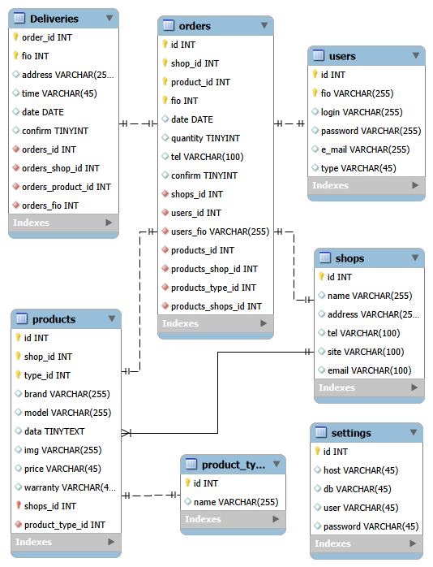
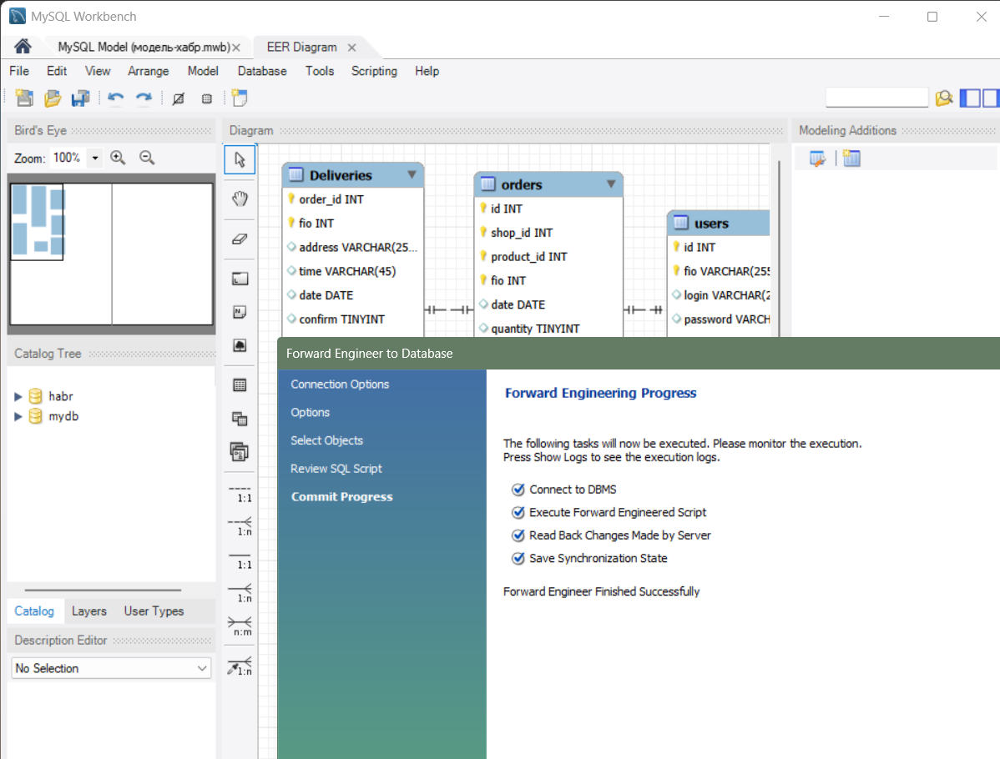
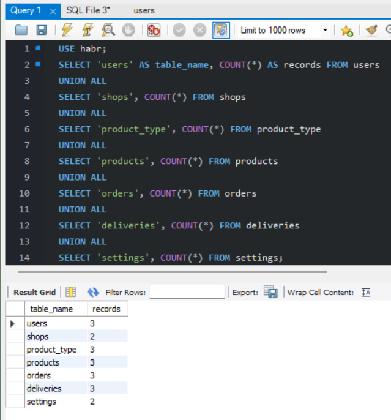
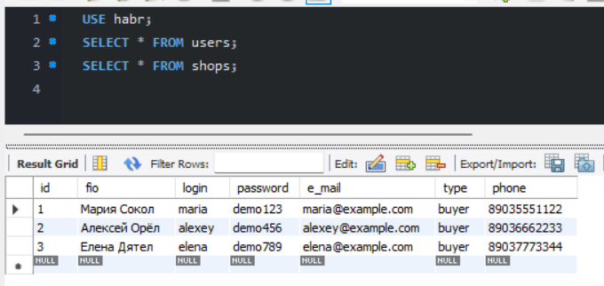
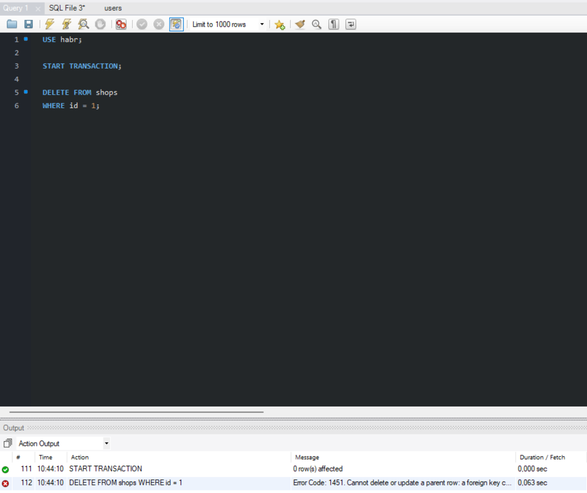

# Лабораторная работа №2
## Схема данных. EER-диаграмма
### Цель работы
Продолжить знакомство с MySQL Workbench, языком запросов SQL и начать осваивать инструмент проектирования баз данных в визуальном редакторе, который предоставляет это ПО.

Для работы использовались MySQL Server, MySQL Workbench и Docker.

## Задание 1
Повторить действия, демонстрируемые в ролике, и создать диаграмму (модель), созданную во второй половине ролика. 
### Схема в виде изоображения

### Запрос, соответствующий созданию этой базы данных
```sql
-- MySQL Script generated by MySQL Workbench
-- Tue Sep 22 09:10:42 2026
-- Model: New Model    Version: 1.0
-- MySQL Workbench Forward Engineering

SET @OLD_UNIQUE_CHECKS=@@UNIQUE_CHECKS, UNIQUE_CHECKS=0;
SET @OLD_FOREIGN_KEY_CHECKS=@@FOREIGN_KEY_CHECKS, FOREIGN_KEY_CHECKS=0;
SET @OLD_SQL_MODE=@@SQL_MODE, SQL_MODE='ONLY_FULL_GROUP_BY,STRICT_TRANS_TABLES,NO_ZERO_IN_DATE,NO_ZERO_DATE,ERROR_FOR_DIVISION_BY_ZERO,NO_ENGINE_SUBSTITUTION';

-- -----------------------------------------------------
-- Schema mydb
-- -----------------------------------------------------

-- -----------------------------------------------------
-- Schema mydb
-- -----------------------------------------------------
CREATE SCHEMA IF NOT EXISTS `mydb` DEFAULT CHARACTER SET utf8 ;
USE `mydb` ;

-- -----------------------------------------------------
-- Table `mydb`.`user`
-- -----------------------------------------------------
CREATE TABLE IF NOT EXISTS `mydb`.`user` (
  `iduser` INT NOT NULL AUTO_INCREMENT,
  `firstname` VARCHAR(45) NOT NULL,
  `secondname` VARCHAR(45) NOT NULL,
  PRIMARY KEY (`iduser`))
ENGINE = InnoDB;


-- -----------------------------------------------------
-- Table `mydb`.`product`
-- -----------------------------------------------------
CREATE TABLE IF NOT EXISTS `mydb`.`product` (
  `idproduct` INT NOT NULL AUTO_INCREMENT,
  `title` VARCHAR(45) NOT NULL,
  `description` TEXT NULL,
  PRIMARY KEY (`idproduct`))
ENGINE = InnoDB;


-- -----------------------------------------------------
-- Table `mydb`.`invoice`
-- -----------------------------------------------------
CREATE TABLE IF NOT EXISTS `mydb`.`invoice` (
  `idinvoice` INT NOT NULL AUTO_INCREMENT,
  `userid` INT NOT NULL,
  `idproduct` INT NOT NULL,
  `cost` DECIMAL(2,10) NOT NULL,
  PRIMARY KEY (`idinvoice`),
  INDEX `fk_invoice_user_idx` (`userid` ASC) VISIBLE,
  INDEX `fk_invoice_product_idx` (`idproduct` ASC) VISIBLE,
  CONSTRAINT `fk_invoice_user`
    FOREIGN KEY (`userid`)
    REFERENCES `mydb`.`user` (`iduser`)
    ON DELETE NO ACTION
    ON UPDATE NO ACTION,
  CONSTRAINT `fk_invoice_product`
    FOREIGN KEY (`idproduct`)
    REFERENCES `mydb`.`product` (`idproduct`)
    ON DELETE NO ACTION
    ON UPDATE NO ACTION)
ENGINE = InnoDB;


SET SQL_MODE=@OLD_SQL_MODE;
SET FOREIGN_KEY_CHECKS=@OLD_FOREIGN_KEY_CHECKS;
SET UNIQUE_CHECKS=@OLD_UNIQUE_CHECKS;
```
### Фрагмент запроса, касающийся создания и настройки таблицы invoice.
```sql
CREATE TABLE IF NOT EXISTS `mydb`.`invoice` (
  `idinvoice` INT NOT NULL AUTO_INCREMENT,
  `userid` INT NOT NULL,
  `idproduct` INT NOT NULL,
  `cost` DECIMAL(2,10) NOT NULL,
  PRIMARY KEY (`idinvoice`),
  INDEX `fk_invoice_user_idx` (`userid` ASC) VISIBLE,
  INDEX `fk_invoice_product_idx` (`idproduct` ASC) VISIBLE,
  CONSTRAINT `fk_invoice_user`
    FOREIGN KEY (`userid`)
    REFERENCES `mydb`.`user` (`iduser`)
    ON DELETE NO ACTION
    ON UPDATE NO ACTION,
  CONSTRAINT `fk_invoice_product`
    FOREIGN KEY (`idproduct`)
    REFERENCES `mydb`.`product` (`idproduct`)
    ON DELETE NO ACTION
    ON UPDATE NO ACTION)
ENGINE = InnoDB;
```
## Задание 2
Создать собственную EER-диаграмму и спроектировать БД с параметрами на основе текста, опубликованного по ссылке.
### Схема в виде изоображения

### Запрос, соответствующий созданию этой базы данных
```sql
-- MySQL Script generated by MySQL Workbench
-- Mon Sep 21 21:43:14 2026
-- Model: New Model    Version: 1.0
-- MySQL Workbench Forward Engineering

SET @OLD_UNIQUE_CHECKS=@@UNIQUE_CHECKS, UNIQUE_CHECKS=0;
SET @OLD_FOREIGN_KEY_CHECKS=@@FOREIGN_KEY_CHECKS, FOREIGN_KEY_CHECKS=0;
SET @OLD_SQL_MODE=@@SQL_MODE, SQL_MODE='ONLY_FULL_GROUP_BY,STRICT_TRANS_TABLES,NO_ZERO_IN_DATE,NO_ZERO_DATE,ERROR_FOR_DIVISION_BY_ZERO,NO_ENGINE_SUBSTITUTION';

-- -----------------------------------------------------
-- Schema mydb
-- -----------------------------------------------------
-- -----------------------------------------------------
-- Schema habr
-- -----------------------------------------------------

-- -----------------------------------------------------
-- Schema habr
-- -----------------------------------------------------
CREATE SCHEMA IF NOT EXISTS `habr` ;
USE `habr` ;

-- -----------------------------------------------------
-- Table `habr`.`users`
-- -----------------------------------------------------
CREATE TABLE IF NOT EXISTS `habr`.`users` (
  `id` INT NOT NULL AUTO_INCREMENT,
  `fio` VARCHAR(255) NOT NULL,
  `login` VARCHAR(255) NULL,
  `password` VARCHAR(255) NULL,
  `e_mail` VARCHAR(255) NULL,
  `type` VARCHAR(45) NULL,
  PRIMARY KEY (`id`, `fio`),
  UNIQUE INDEX `id_UNIQUE` (`id` ASC) VISIBLE,
  UNIQUE INDEX `login_UNIQUE` (`login` ASC) VISIBLE)
ENGINE = InnoDB;


-- -----------------------------------------------------
-- Table `habr`.`settings`
-- -----------------------------------------------------
CREATE TABLE IF NOT EXISTS `habr`.`settings` (
  `id` INT NOT NULL AUTO_INCREMENT,
  `host` VARCHAR(45) NULL,
  `db` VARCHAR(45) NULL,
  `user` VARCHAR(45) NULL,
  `password` VARCHAR(45) NULL,
  PRIMARY KEY (`id`),
  UNIQUE INDEX `id_UNIQUE` (`id` ASC) VISIBLE)
ENGINE = InnoDB;


-- -----------------------------------------------------
-- Table `habr`.`shops`
-- -----------------------------------------------------
CREATE TABLE IF NOT EXISTS `habr`.`shops` (
  `id` INT NOT NULL AUTO_INCREMENT,
  `name` VARCHAR(255) NULL,
  `address` VARCHAR(255) NULL,
  `tel` VARCHAR(100) NULL,
  `site` VARCHAR(100) NULL,
  `email` VARCHAR(100) NULL,
  PRIMARY KEY (`id`),
  UNIQUE INDEX `id_UNIQUE` (`id` ASC) VISIBLE)
ENGINE = InnoDB;


-- -----------------------------------------------------
-- Table `habr`.`product_type`
-- -----------------------------------------------------
CREATE TABLE IF NOT EXISTS `habr`.`product_type` (
  `id` INT NOT NULL AUTO_INCREMENT,
  `name` VARCHAR(255) NULL,
  PRIMARY KEY (`id`),
  UNIQUE INDEX `id_UNIQUE` (`id` ASC) VISIBLE)
ENGINE = InnoDB;


-- -----------------------------------------------------
-- Table `habr`.`products`
-- -----------------------------------------------------
CREATE TABLE IF NOT EXISTS `habr`.`products` (
  `id` INT NOT NULL AUTO_INCREMENT,
  `shop_id` INT NOT NULL,
  `type_id` INT NOT NULL,
  `brand` VARCHAR(255) NULL,
  `model` VARCHAR(255) NULL,
  `data` TINYTEXT NULL,
  `img` VARCHAR(255) NULL,
  `price` VARCHAR(45) NULL,
  `warranty` VARCHAR(45) NULL,
  `shops_id` INT NOT NULL,
  `product_type_id` INT NOT NULL,
  PRIMARY KEY (`id`, `shop_id`, `type_id`, `shops_id`),
  UNIQUE INDEX `id_UNIQUE` (`id` ASC) VISIBLE,
  INDEX `fk_products_shops_idx` (`shops_id` ASC) VISIBLE,
  INDEX `fk_products_product_type1_idx` (`product_type_id` ASC) VISIBLE,
  CONSTRAINT `fk_products_shops`
    FOREIGN KEY (`shops_id`)
    REFERENCES `habr`.`shops` (`id`)
    ON DELETE NO ACTION
    ON UPDATE NO ACTION,
  CONSTRAINT `fk_products_product_type1`
    FOREIGN KEY (`product_type_id`)
    REFERENCES `habr`.`product_type` (`id`)
    ON DELETE NO ACTION
    ON UPDATE NO ACTION)
ENGINE = InnoDB;


-- -----------------------------------------------------
-- Table `habr`.`orders`
-- -----------------------------------------------------
CREATE TABLE IF NOT EXISTS `habr`.`orders` (
  `id` INT NOT NULL AUTO_INCREMENT,
  `shop_id` INT NOT NULL,
  `product_id` INT NOT NULL,
  `fio` INT NOT NULL,
  `date` DATE NULL,
  `quantity` TINYINT NULL,
  `tel` VARCHAR(100) NULL,
  `confirm` TINYINT NULL,
  `shops_id` INT NOT NULL,
  `users_id` INT NOT NULL,
  `users_fio` VARCHAR(255) NOT NULL,
  `products_id` INT NOT NULL,
  `products_shop_id` INT NOT NULL,
  `products_type_id` INT NOT NULL,
  `products_shops_id` INT NOT NULL,
  PRIMARY KEY (`id`, `shop_id`, `product_id`, `fio`),
  UNIQUE INDEX `id_UNIQUE` (`id` ASC) VISIBLE,
  INDEX `fk_orders_shops1_idx` (`shops_id` ASC) VISIBLE,
  INDEX `fk_orders_users1_idx` (`users_id` ASC, `users_fio` ASC) VISIBLE,
  INDEX `fk_orders_products1_idx` (`products_id` ASC, `products_shop_id` ASC, `products_type_id` ASC, `products_shops_id` ASC) VISIBLE,
  CONSTRAINT `fk_orders_shops1`
    FOREIGN KEY (`shops_id`)
    REFERENCES `habr`.`shops` (`id`)
    ON DELETE NO ACTION
    ON UPDATE NO ACTION,
  CONSTRAINT `fk_orders_users1`
    FOREIGN KEY (`users_id` , `users_fio`)
    REFERENCES `habr`.`users` (`id` , `fio`)
    ON DELETE NO ACTION
    ON UPDATE NO ACTION,
  CONSTRAINT `fk_orders_products1`
    FOREIGN KEY (`products_id` , `products_shop_id` , `products_type_id` , `products_shops_id`)
    REFERENCES `habr`.`products` (`id` , `shop_id` , `type_id` , `shops_id`)
    ON DELETE NO ACTION
    ON UPDATE NO ACTION)
ENGINE = InnoDB;


-- -----------------------------------------------------
-- Table `habr`.`Deliveries`
-- -----------------------------------------------------
CREATE TABLE IF NOT EXISTS `habr`.`Deliveries` (
  `order_id` INT NOT NULL AUTO_INCREMENT,
  `fio` INT NOT NULL,
  `address` VARCHAR(255) NULL,
  `time` VARCHAR(45) NULL,
  `date` DATE NULL,
  `confirm` TINYINT NULL,
  `orders_id` INT NOT NULL,
  `orders_shop_id` INT NOT NULL,
  `orders_product_id` INT NOT NULL,
  `orders_fio` INT NOT NULL,
  PRIMARY KEY (`order_id`, `fio`),
  UNIQUE INDEX `order_id_UNIQUE` (`order_id` ASC) VISIBLE,
  INDEX `fk_Deliveries_orders1_idx` (`orders_id` ASC, `orders_shop_id` ASC, `orders_product_id` ASC, `orders_fio` ASC) VISIBLE,
  CONSTRAINT `fk_Deliveries_orders1`
    FOREIGN KEY (`orders_id` , `orders_shop_id` , `orders_product_id` , `orders_fio`)
    REFERENCES `habr`.`orders` (`id` , `shop_id` , `product_id` , `fio`)
    ON DELETE NO ACTION
    ON UPDATE NO ACTION)
ENGINE = InnoDB;


SET SQL_MODE=@OLD_SQL_MODE;
SET FOREIGN_KEY_CHECKS=@OLD_FOREIGN_KEY_CHECKS;
SET UNIQUE_CHECKS=@OLD_UNIQUE_CHECKS;
```
### Фрагмент запроса, касающийся создания и настройки таблицы Orders.
```sql
CREATE TABLE IF NOT EXISTS `habr`.`orders` (
  `id` INT NOT NULL AUTO_INCREMENT,
  `shop_id` INT NOT NULL,
  `product_id` INT NOT NULL,
  `fio` INT NOT NULL,
  `date` DATE NULL,
  `quantity` TINYINT NULL,
  `tel` VARCHAR(100) NULL,
  `confirm` TINYINT NULL,
  `shops_id` INT NOT NULL,
  `users_id` INT NOT NULL,
  `users_fio` VARCHAR(255) NOT NULL,
  `products_id` INT NOT NULL,
  `products_shop_id` INT NOT NULL,
  `products_type_id` INT NOT NULL,
  `products_shops_id` INT NOT NULL,
  PRIMARY KEY (`id`, `shop_id`, `product_id`, `fio`),
  UNIQUE INDEX `id_UNIQUE` (`id` ASC) VISIBLE,
  INDEX `fk_orders_shops1_idx` (`shops_id` ASC) VISIBLE,
  INDEX `fk_orders_users1_idx` (`users_id` ASC, `users_fio` ASC) VISIBLE,
  INDEX `fk_orders_products1_idx` (`products_id` ASC, `products_shop_id` ASC, `products_type_id` ASC, `products_shops_id` ASC) VISIBLE,
  CONSTRAINT `fk_orders_shops1`
    FOREIGN KEY (`shops_id`)
    REFERENCES `habr`.`shops` (`id`)
    ON DELETE NO ACTION
    ON UPDATE NO ACTION,
  CONSTRAINT `fk_orders_users1`
    FOREIGN KEY (`users_id` , `users_fio`)
    REFERENCES `habr`.`users` (`id` , `fio`)
    ON DELETE NO ACTION
    ON UPDATE NO ACTION,
  CONSTRAINT `fk_orders_products1`
    FOREIGN KEY (`products_id` , `products_shop_id` , `products_type_id` , `products_shops_id`)
    REFERENCES `habr`.`products` (`id` , `shop_id` , `type_id` , `shops_id`)
    ON DELETE NO ACTION
    ON UPDATE NO ACTION)
ENGINE = InnoDB;
```
## Задание 3
Выполнитm операцию Database - Forward Engineer и создать базу данных на вашем сервере.

## Задание 4
Добавить несколько строк и новых атрибутов в каждую таблицу созданной базы данных. 


Попробовать удалить связанные в нескольких таблицах данные.

Почему ошибка? Магазин используется в таблицах products и orders, а при создании связей мы выбрали ON DELETE NO ACTION. MySQL не разрешает удалить магазин, пока существуют записи, которые на него ссылаются.
